# OpenClaw 项目文档

> 最后更新：2026年02月11日 00:58:28
> 文档生成：自适应初始化架构师

## 项目愿景

OpenClaw 是一个**个人 AI 助手**，运行在您自己的设备上。它可以通过您已经使用的消息渠道（WhatsApp、Telegram、Slack、Discord、Google Chat、Signal、iMessage、Microsoft Teams、WebChat 等）与您交互，支持扩展渠道如 BlueBubbles、Matrix、Zalo 和 Zalo Personal。它可以在 macOS/iOS/Android 上进行语音交互，并可以渲染您控制的实时 Canvas。Gateway 只是控制平面——真正的产品是助手本身。

## 架构总览

```
┌─────────────────────────────────────────────────────────────────┐
│                        消息渠道层                                │
│  WhatsApp │ Telegram │ Slack │ Discord │ Google Chat │ Signal  │
│  BlueBubbles │ iMessage │ Teams │ Matrix │ Zalo │ WebChat      │
└─────────────────────────────────────────────────────────────────┘
                              │
                              ▼
┌─────────────────────────────────────────────────────────────────┐
│                       Gateway 控制平面                          │
│                     (WebSocket Server)                          │
│                   ws://127.0.0.1:18789                          │
└─────────────────────────────────────────────────────────────────┘
                              │
        ┌─────────────────────┼─────────────────────┐
        ▼                     ▼                     ▼
┌───────────────┐   ┌───────────────┐   ┌───────────────┐
│  Pi Agent     │   │  CLI/Commands │   │   UI/Control  │
│   (RPC)       │   │  (openclaw)   │   │   (Web/TUI)   │
└───────────────┘   └───────────────┘   └───────────────┘
        │                     │                     │
        ▼                     ▼                     ▼
┌───────────────┐   ┌───────────────┐   ┌───────────────┐
│  macOS App    │   │ iOS/Android   │   │  Extensions   │
│  Menu Bar     │   │    Nodes      │   │   Plugins     │
└───────────────┘   └───────────────┘   └───────────────┘
```

## 模块结构图

```mermaid
graph TD
    A["(根) openclaw"] --> B["src/"]
    A --> C["apps/"]
    A --> D["extensions/"]
    A --> E["skills/"]
    A --> F["ui/"]
    A --> G["vendor/"]
    A --> H["docs/"]
    A --> I["scripts/"]

    B --> J["agents/ - AI 代理运行时"]
    B --> K["gateway/ - WebSocket 控制平面"]
    B --> L["channels/ - 消息渠道集成"]
    B --> M["commands/ - CLI 命令"]
    B --> N["config/ - 配置管理"]
    B --> O["browser/ - 浏览器自动化"]
    B --> P["cli/ - 命令行界面"]
    B --> Q["wizard/ - 向导流程"]
    B --> R["acp/ - Agent Client Protocol"]

    C --> S["android/ - Android 应用"]
    C --> T["ios/ - iOS 应用"]
    C --> U["macos/ - macOS 应用"]
    C --> V["shared/ - 共享代码"]

    D --> W["bluebubbles/ - iMessage 集成"]
    D --> X["discord/ - Discord 集成"]
    D --> Y["feishu/ - 飞书集成"]
    D --> Z["googlechat/ - Google Chat 集成"]

    E --> AA["本地技能扩展"]

    F --> AB["Web UI 控制界面"]

    G --> AC["a2ui/ - Canvas 渲染器"]

    H --> AD["项目文档"]

    I --> AE["构建和部署脚本"]

    click B "#src-core" "查看核心源码模块"
    click C "#apps-mobile" "查看移动应用模块"
    click D "#extensions-integrations" "查看扩展集成"
    click E "#skills-plugins" "查看技能插件"
    click F "#ui-web" "查看 Web UI"
    click H "#docs-documentation" "查看文档"
```



## 模块索引

| 模块路径                  | 职责描述                                                        | 语言       | 入口文件          | 测试目录    |
| ------------------------- | --------------------------------------------------------------- | ---------- | ----------------- | ----------- |
| `src/agents/`             | AI 代理运行时，包括 Pi Agent 嵌入式运行时、认证配置、工具定义等 | TypeScript | `pi-embedded.ts`  | `*.test.ts` |
| `src/gateway/`            | WebSocket 控制平面，处理会话、配置、事件广播等                  | TypeScript | `server.ts`       | `*.test.ts` |
| `src/channels/`           | 消息渠道集成，包括插件系统、消息路由等                          | TypeScript | `registry.ts`     | `*.test.ts` |
| `src/commands/`           | CLI 命令实现，包括 agent、gateway、configure 等                 | TypeScript | `agent.ts`        | `*.test.ts` |
| `src/config/`             | 配置管理，包括配置加载、验证、迁移等                            | TypeScript | `config.ts`       | `*.test.ts` |
| `src/browser/`            | 浏览器自动化，基于 Playwright 的控制服务                        | TypeScript | `server.ts`       | `*.test.ts` |
| `src/cli/`                | 命令行界面框架和工具                                            | TypeScript | `program/`        | `*.test.ts` |
| `src/wizard/`             | 向导流程，处理新用户入门                                        | TypeScript | `onboarding.ts`   | `*.test.ts` |
| `src/acp/`                | Agent Client Protocol 实现                                      | TypeScript | `server.ts`       | `*.test.ts` |
| `src/plugin-sdk/`         | 插件开发 SDK                                                    | TypeScript | `index.ts`        | `*.test.ts` |
| `apps/android/`           | Android 应用，支持 Canvas、语音、相机等                         | Kotlin     | `MainActivity.kt` | `*/test/`   |
| `apps/ios/`               | iOS 应用，支持 Canvas、语音、Bonjour 配对等                     | Swift      | `Sources/`        | -           |
| `apps/macos/`             | macOS 菜单栏应用，控制平面                                      | Swift      | `Sources/`        | -           |
| `extensions/bluebubbles/` | BlueBubbles iMessage 集成扩展                                   | TypeScript | `index.ts`        | `*.test.ts` |
| `extensions/discord/`     | Discord 集成扩展                                                | TypeScript | `index.ts`        | -           |
| `extensions/feishu/`      | 飞书集成扩展                                                    | TypeScript | `index.ts`        | -           |
| `extensions/googlechat/`  | Google Chat 集成扩展                                            | TypeScript | `index.ts`        | -           |
| `skills/`                 | 技能插件集合，包括各种第三方服务集成                            | 混合       | `SKILL.md`        | -           |
| `ui/`                     | Web UI 控制界面                                                 | TypeScript | `src/main.ts`     | `*.test.ts` |
| `vendor/a2ui/`            | Canvas A2UI 渲染器（第三方库）                                  | 多种       | `renderers/`      | -           |

## 运行与开发

### 安装依赖

```bash
pnpm install
pnpm ui:build  # 自动安装 UI 依赖
pnpm build
```

### 开发模式

```bash
# 启动 Gateway（自动重载）
pnpm gateway:watch

# 启动 TUI（终端用户界面）
pnpm tui:dev

# 启动 Web UI 开发服务器
pnpm ui:dev
```

### 运行测试

```bash
# 单元测试
pnpm test

# 覆盖率测试
pnpm test:coverage

# E2E 测试
pnpm test:e2e

# 实时测试（需要真实 API）
pnpm test:live
```

### 构建

```bash
pnpm build
# 输出到 dist/ 目录
```

### CLI 使用

```bash
# 启动 Gateway
openclaw gateway --port 18789 --verbose

# 发送消息
openclaw message send --to +1234567890 --message "Hello"

# 与助手对话
openclaw agent --message "Ship checklist" --thinking high

# 配置向导
openclaw onboard --install-daemon
```

## 测试策略

### 单元测试

- 框架：Vitest
- 配置文件：`vitest.config.ts`
- 覆盖率目标：行覆盖率 70%，分支覆盖率 55%
- 测试位置：每个模块同目录下的 `*.test.ts` 文件

### E2E 测试

- 配置文件：`vitest.e2e.config.ts`
- 测试脚本：`scripts/e2e/*.sh`
- Docker 测试：`scripts/docker/*/Dockerfile`

### 实时测试

- 配置文件：`vitest.live.config.ts`
- 需要设置环境变量：`OPENCLAW_LIVE_TEST=1`
- 测试真实 API 调用

### 测试覆盖率排除

- 入口文件和接线代码通过 CI 烟雾测试和手动/E2E 流程验证
- 代理集成部分通过手动/E2E 运行验证
- Gateway 服务器集成表面通过手动/E2E 运行验证
- 进程桥接器难以在隔离中单元测试

## 编码规范

### 代码格式化

- 格式化工具：`oxfmt`
- 检查：`pnpm format:check`
- 修复：`pnpm format`

### 代码检查

- Lint 工具：`oxlint`
- 类型感知 lint：`pnpm lint`
- 自动修复：`pnpm lint:fix`

### TypeScript

- 严格模式开启
- 目标版本：ES2023
- 模块系统：NodeNext
- 路径映射：支持 `openclaw/plugin-sdk` 别名

### 测试规范

- 测试文件与源文件同目录
- 测试文件命名：`*.test.ts`
- 使用 `vitest` 断言
- 并行测试执行

## AI 使用指引

### 项目结构理解

1. **核心入口**：`src/entry.ts` → `src/cli/run-main.ts` → `src/cli/program/`
2. **Gateway 核心**：`src/gateway/server.ts` 提供 WebSocket 控制平面
3. **Agent 运行时**：`src/agents/` 包含 Pi Agent 嵌入式运行时和工具
4. **消息渠道**：`src/channels/` 处理各种消息平台的集成
5. **扩展系统**：`extensions/` 包含各种第三方服务集成

### 关键配置

- 主配置文件：`~/.openclaw/config.yaml`（用户目录）
- 会话存储：`~/.openclaw/sessions/`
- 技能目录：`~/.openclaw/skills/` 和项目 `skills/`
- 插件目录：`extensions/`

### 调试技巧

- Gateway 日志：`--verbose` 标志
- 测试单个文件：`vitest run path/to/test.test.ts`
- 开发模式自动重载：`pnpm gateway:watch`
- TUI 调试：`pnpm tui:dev`

### 重要概念

- **会话模型**：`main` 会话用于直接对话，组会话隔离
- **认证配置**：支持 OAuth 和 API Key，自动轮换和故障转移
- **渠道路由**：根据渠道/账户/对等方路由到隔离的代理
- **工具流**：代理可调用浏览器、Canvas、节点、cron 等工具
- **安全默认**：DM 访问需要配对，未知发送者需明确批准

## 变更记录 (Changelog)

### 2026-02-11 00:58:28

- 初始化项目文档
- 完成全仓扫描，识别主要模块结构
- 创建模块索引和架构图

### 覆盖率统计

- **估算总文件数**：约 2500+ 源代码文件（排除 node_modules）
- **已扫描文件数**：约 600+ 文件
- **覆盖百分比**：约 24%（第一阶段快速扫描）
- **主要缺口**：
  - `apps/android/` 详细实现（已识别主要结构）
  - `apps/ios/` 详细实现（已识别主要结构）
  - `apps/macos/` 详细实现（已识别主要结构）
  - `extensions/` 各扩展详细实现
  - `skills/` 各技能详细实现
  - `src/agents/tools/` 详细实现
  - `src/gateway/server-methods/` 详细实现

### 下一步建议

1. 优先补扫 `src/gateway/server-methods/` - Gateway 核心方法实现
2. 优先补扫 `src/agents/tools/` - 代理工具定义
3. 优先补扫 `extensions/*/src/` - 扩展实现细节
4. 优先补扫 `apps/*/Sources/` 或 `*/src/` - 移动应用实现
5. 补充 `test/` 目录下的测试覆盖情况分析
