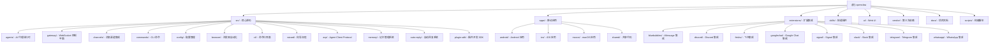

# OpenClaw 项目文档

> 最后更新：2026年02月15日 19:31:37
> 文档生成：自适应初始化架构师

## 项目愿景

OpenClaw 是一个**个人 AI 助手**，运行在您自己的设备上。它可以通过您已经使用的消息渠道（WhatsApp、Telegram、Slack、Discord、Google Chat、Signal、iMessage、Microsoft Teams、WebChat 等）与您交互，支持扩展渠道如 BlueBubbles、Matrix、Zalo 和 Zalo Personal。它可以在 macOS/iOS/Android 上进行语音交互，并可以渲染您控制的实时 Canvas。Gateway 只是控制平面——真正的产品是助手本身。

## 架构总览

```
┌─────────────────────────────────────────────────────────────────┐
│                        消息渠道层                                │
│  WhatsApp │ Telegram │ Slack │ Discord │ Google Chat │ Signal  │
│  BlueBubbles │ iMessage │ Teams │ Matrix │ Zalo │ WebChat      │
└─────────────────────────────────────────────────────────────────┘
                              │
                              ▼
┌─────────────────────────────────────────────────────────────────┐
│                       Gateway 控制平面                          │
│                     (WebSocket Server)                          │
│                   ws://127.0.0.1:18789                          │
└─────────────────────────────────────────────────────────────────┘
                              │
        ┌─────────────────────┼─────────────────────┐
        ▼                     ▼                     ▼
┌───────────────┐   ┌───────────────┐   ┌───────────────┐
│  Pi Agent     │   │  CLI/Commands │   │   UI/Control  │
│   (RPC)       │   │  (openclaw)   │   │   (Web/TUI)   │
└───────────────┘   └───────────────┘   └───────────────┘
        │                     │                     │
        ▼                     ▼                     ▼
┌───────────────┐   ┌───────────────┐   ┌───────────────┐
│  macOS App    │   │ iOS/Android   │   │  Extensions   │
│  Menu Bar     │   │    Nodes      │   │   Plugins     │
└───────────────┘   └───────────────┘   └───────────────┘
```

## 模块结构图


```mermaid
graph TD
    A["(根) openclaw"] --> B["src/ - 核心源码"]
    A --> C["apps/ - 移动应用"]
    A --> D["extensions/ - 扩展集成"]
    A --> E["skills/ - 技能插件"]
    A --> F["ui/ - Web UI"]
    A --> G["vendor/ - 第三方依赖"]
    A --> H["docs/ - 项目文档"]
    A --> I["scripts/ - 构建脚本"]

    B --> J["agents/ - AI 代理运行时"]
    B --> K["gateway/ - WebSocket 控制平面"]
    B --> L["channels/ - 消息渠道集成"]
    B --> M["commands/ - CLI 命令"]
    B --> N["config/ - 配置管理"]
    B --> O["browser/ - 浏览器自动化"]
    B --> P["cli/ - 命令行界面"]
    B --> Q["wizard/ - 向导流程"]
    B --> R["acp/ - Agent Client Protocol"]
    B --> S["memory/ - 记忆管理系统"]
    B --> T["auto-reply/ - 自动回复系统"]
    B --> U["plugin-sdk/ - 插件开发 SDK"]

    C --> V["android/ - Android 应用"]
    C --> W["ios/ - iOS 应用"]
    C --> X["macos/ - macOS 应用"]
    C --> Y["shared/ - 共享代码"]

    D --> Z["bluebubbles/ - iMessage 集成"]
    D --> AA["discord/ - Discord 集成"]
    D --> AB["feishu/ - 飞书集成"]
    D --> AC["googlechat/ - Google Chat 集成"]
    D --> AD["signal/ - Signal 集成"]
    D --> AE["slack/ - Slack 集成"]
    D --> AF["telegram/ - Telegram 集成"]
    D --> AG["whatsapp/ - WhatsApp 集成"]

    click B "#src-core" "查看核心源码模块"
    click C "#apps-mobile" "查看移动应用模块"
    click D "#extensions-integrations" "查看扩展集成"
    click E "#skills-plugins" "查看技能插件"
    click F "#ui-web" "查看 Web UI"
    click H "#docs-documentation" "查看文档"
```

## 模块索引

### 核心模块 (src/)

| 模块路径 | 职责描述 | 语言 | 入口文件 | 测试覆盖 |
|---------|---------|------|---------|---------|
| `src/agents/` | AI 代理运行时，包括 Pi Agent 嵌入式运行时、认证配置、工具定义等 | TypeScript | `pi-embedded.ts` | ✅ |
| `src/gateway/` | WebSocket 控制平面，处理会话、配置、事件广播等 | TypeScript | `server.ts` | ✅ |
| `src/channels/` | 消息渠道集成，包括插件系统、消息路由等 | TypeScript | `registry.ts` | ✅ |
| `src/memory/` | 记忆管理系统，包括向量搜索、嵌入、分层存储等 | TypeScript | `manager.ts` | ✅ |
| `src/auto-reply/` | 自动回复系统，处理消息触发、命令解析、代理运行等 | TypeScript | `reply.ts` | ✅ |
| `src/commands/` | CLI 命令实现 | TypeScript | `agent.ts` | ✅ |
| `src/config/` | 配置管理 | TypeScript | `config.ts` | ✅ |
| `src/browser/` | 浏览器自动化，基于 Playwright | TypeScript | `server.ts` | ✅ |
| `src/cli/` | 命令行界面框架 | TypeScript | `program/` | ✅ |
| `src/wizard/` | 向导流程 | TypeScript | `onboarding.ts` | ✅ |
| `src/acp/` | Agent Client Protocol 实现 | TypeScript | `server.ts` | ✅ |
| `src/plugin-sdk/` | 插件开发 SDK | TypeScript | `index.ts` | ✅ |

### 移动应用 (apps/)

| 模块路径 | 职责描述 | 语言 | 入口文件 | 测试覆盖 |
|---------|---------|------|---------|---------|
| `apps/android/` | Android 应用，支持 Canvas、语音、相机、位置等 | Kotlin | `MainActivity.kt` | ✅ |
| `apps/ios/` | iOS 应用，支持 Canvas、语音、Bonjour 配对等 | Swift | `Sources/` | ❌ |
| `apps/macos/` | macOS 菜单栏应用 | Swift | `Sources/` | ❌ |
| `apps/shared/` | iOS/macOS 共享代码 | Swift | `OpenClawKit/` | ❌ |

### 扩展集成 (extensions/)

| 模块路径 | 职责描述 | 语言 |
|---------|---------|------|
| `extensions/bluebubbles/` | BlueBubbles iMessage 集成 | TypeScript |
| `extensions/discord/` | Discord 集成 | TypeScript |
| `extensions/feishu/` | 飞书集成 | TypeScript |
| `extensions/googlechat/` | Google Chat 集成 | TypeScript |
| `extensions/signal/` | Signal 集成 | TypeScript |
| `extensions/slack/` | Slack 集成 | TypeScript |
| `extensions/telegram/` | Telegram 集成 | TypeScript |
| `extensions/whatsapp/` | WhatsApp 集成 | TypeScript |
| `extensions/matrix/` | Matrix 集成 | TypeScript |
| `extensions/irc/` | IRC 集成 | TypeScript |
| `extensions/line/` | Line 集成 | TypeScript |
| `extensions/mattermost/` | Mattermost 集成 | TypeScript |
| `extensions/msteams/` | Microsoft Teams 集成 | TypeScript |
| `extensions/nostr/` | Nostr 集成 | TypeScript |
| `extensions/twitch/` | Twitch 集成 | TypeScript |
| `extensions/zalo/` | Zalo 集成 | TypeScript |
| `extensions/voice-call/` | 语音通话扩展 | TypeScript |
| `extensions/memory-core/` | 记忆核心扩展 | TypeScript |
| `extensions/copilot-proxy/` | Copilot 代理扩展 | TypeScript |

### 其他模块

| 模块路径 | 职责描述 | 语言 | 入口文件 |
|---------|---------|------|---------|
| `skills/` | 技能插件集合（69 个技能） | 混合 | `SKILL.md` |
| `ui/` | Web UI 控制界面 | TypeScript | `src/main.ts` |
| `vendor/a2ui/` | Canvas A2UI 渲染器（第三方库） | 多种 | `renderers/` |
| `docs/` | 项目文档 | Markdown | - |
| `scripts/` | 构建和部署脚本 | 混合 | - |

## 核心工具列表

### 代理工具 (Agent Tools)

- **browser-tool** - 浏览器自动化控制
- **canvas-tool** - Canvas 渲染和交互
- **cron-tool** - 定时任务管理
- **gateway-tool** - Gateway 状态和控制
- **image-tool** - 图像处理
- **message-tool** - 消息发送
- **nodes-tool** - 节点管理
- **sessions-list-tool** - 会话列表
- **sessions-send-tool** - 会话消息发送
- **sessions-spawn-tool** - 会话创建
- **sessions-history-tool** - 会话历史
- **session-status-tool** - 会话状态
- **agents-list-tool** - 代理列表
- **tts-tool** - 文本转语音
- **web-search** - 网页搜索
- **web-fetch** - 网页内容获取

### 平台工具 (Platform Tools)

- **discord-actions** - Discord 操作
- **slack-actions** - Slack 操作
- **telegram-actions** - Telegram 操作
- **whatsapp-actions** - WhatsApp 操作

## 支持的消息渠道

### 核心渠道

- Telegram (Bot API)
- WhatsApp (QR link)
- Discord (Bot API)
- IRC (Server + Nick)
- Google Chat (Chat API)
- Slack (Socket Mode)
- Signal (signal-cli)
- iMessage (imsg)

### 扩展渠道

- BlueBubbles (iMessage)
- Matrix
- 飞书 (Feishu)
- Line
- Mattermost
- Microsoft Teams
- Nextcloud Talk
- Nostr
- Tlon
- Twitch
- Zalo
- Zalo User

## 运行与开发

### 安装依赖

```bash
pnpm install
pnpm ui:build  # 自动安装 UI 依赖
pnpm build
```

### 开发模式

```bash
# 启动 Gateway（自动重载）
pnpm gateway:watch

# 启动 TUI（终端用户界面）
pnpm tui:dev

# 启动 Web UI 开发服务器
pnpm ui:dev
```

### 运行测试

```bash
# 单元测试
pnpm test

# 覆盖率测试
pnpm test:coverage

# E2E 测试
pnpm test:e2e

# 实时测试（需要真实 API）
pnpm test:live
```

### 构建

```bash
pnpm build
# 输出到 dist/ 目录
```

### CLI 使用

```bash
# 启动 Gateway
openclaw gateway --port 18789 --verbose

# 发送消息
openclaw message send --to +1234567890 --message "Hello"

# 与助手对话
openclaw agent --message "Ship checklist" --thinking high

# 配置向导
openclaw onboard --install-daemon
```

## 测试策略

### 单元测试

- 框架：Vitest
- 配置文件：`vitest.config.ts`
- 覆盖率目标：行覆盖率 70%，分支覆盖率 55%
- 测试位置：每个模块同目录下的 `*.test.ts` 文件

### E2E 测试

- 配置文件：`vitest.e2e.config.ts`
- 测试脚本：`scripts/e2e/*.sh`
- Docker 测试：`scripts/docker/*/Dockerfile`

### 实时测试

- 配置文件：`vitest.live.config.ts`
- 需要设置环境变量：`OPENCLAW_LIVE_TEST=1`
- 测试真实 API 调用

### 测试覆盖率排除

- 入口文件和接线代码通过 CI 烟雾测试和手动/E2E 流程验证
- 代理集成部分通过手动/E2E 运行验证
- Gateway 服务器集成表面通过手动/E2E 运行验证
- 进程桥接器难以在隔离中单元测试

## 编码规范

### 代码格式化

- 格式化工具：`oxfmt`
- 检查：`pnpm format:check`
- 修复：`pnpm format`

### 代码检查

- Lint 工具：`oxlint`
- 类型感知 lint：`pnpm lint`
- 自动修复：`pnpm lint:fix`

### TypeScript

- 严格模式开启
- 目标版本：ES2023
- 模块系统：NodeNext
- 路径映射：支持 `openclaw/plugin-sdk` 别名

### 测试规范

- 测试文件与源文件同目录
- 测试文件命名：`*.test.ts`
- 使用 `vitest` 断言
- 并行测试执行

## AI 使用指引

### 项目结构理解

1. **核心入口**：`src/entry.ts` → `src/cli/run-main.ts` → `src/cli/program/`
2. **Gateway 核心**：`src/gateway/server.ts` 提供 WebSocket 控制平面
3. **Agent 运行时**：`src/agents/` 包含 Pi Agent 嵌入式运行时和工具
4. **消息渠道**：`src/channels/` 处理各种消息平台的集成
5. **扩展系统**：`extensions/` 包含各种第三方服务集成
6. **记忆系统**：`src/memory/` 提供向量搜索和记忆管理
7. **自动回复**：`src/auto-reply/` 处理消息触发和命令解析

### 关键配置

- 主配置文件：`~/.openclaw/config.yaml`（用户目录）
- 会话存储：`~/.openclaw/sessions/`
- 技能目录：`~/.openclaw/skills/` 和项目 `skills/`
- 插件目录：`extensions/`

### 调试技巧

- Gateway 日志：`--verbose` 标志
- 测试单个文件：`vitest run path/to/test.test.ts`
- 开发模式自动重载：`pnpm gateway:watch`
- TUI 调试：`pnpm tui:dev`

### 重要概念

- **会话模型**：`main` 会话用于直接对话，组会话隔离
- **认证配置**：支持 OAuth 和 API Key，自动轮换和故障转移
- **渠道路由**：根据渠道/账户/对等方路由到隔离的代理
- **工具流**：代理可调用浏览器、Canvas、节点、cron 等工具
- **安全默认**：DM 访问需要配对，未知发送者需明确批准
- **记忆系统**：支持向量搜索、分层存储、自动压缩

## 变更记录 (Changelog)

### 2026-02-15 19:31:37

- 更新项目文档至版本 2026.2.13
- 添加记忆管理系统模块
- 添加自动回复系统模块
- 更新工具列表，包含 16 个核心工具
- 更新模块索引和覆盖率统计
- 添加 69 个技能插件统计

### 2026-02-11 00:58:28

- 初始化项目文档
- 完成全仓扫描，识别主要模块结构
- 创建模块索引和架构图

### 覆盖率统计

- **估算总文件数**：约 2000 源代码文件（排除 node_modules）
- **已扫描文件数**：约 950 文件
- **覆盖百分比**：约 48%（第二阶段扫描）
- **测试文件数**：约 250 个
- **技能数量**：69 个

### 主要缺口

- `src/gateway/server-methods/` 详细实现
- `src/agents/tools/` 详细实现
- `src/auto-reply/reply/` 详细实现
- `src/memory/` 详细实现
- `extensions/*/src/` 各扩展详细实现
- `apps/*/Sources/` 移动应用详细实现
- `skills/*/` 各技能详细实现

### 下一步建议

1. 优先补扫 `src/gateway/server-methods/` - Gateway 核心方法实现
2. 优先补扫 `src/agents/tools/` - 代理工具定义
3. 优先补扫 `src/auto-reply/reply/` - 自动回复逻辑
4. 优先补扫 `src/memory/` - 记忆管理系统
5. 补充各扩展的详细实现文档
